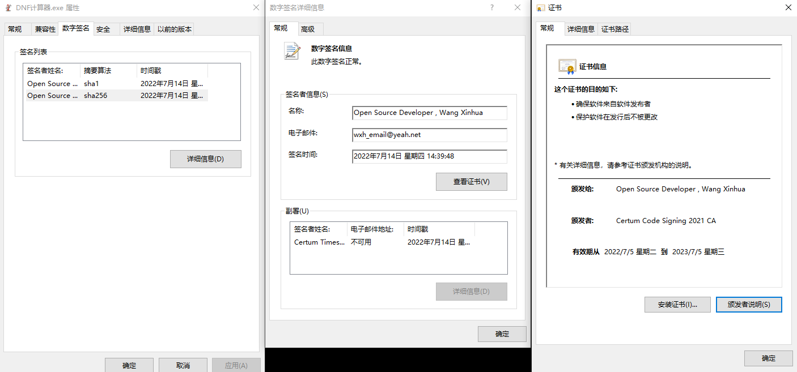

## 软件简介


本软件为 DNF 相关的计算器，供玩家进行搭配装备及伤害计算等各方面使用</br> 目前职业还在陆续添加中，预计一周 2~3 个职业

## 开始使用

<strong>下载路径</strong>: https://wwn.lanzout.com/s/dcalc<br>

</br>

下载网盘中最新程序`DNF计算器_XX.XX_.exe`并完成安装</br>

- exe：安装包，多次使用会删除老的存档
- 绿色版：免安装版本，解压到目录下后，打开`DNF计算器.exe`即可，覆盖不会删除存档
- 更新包：计算器的更新文件，可手动下载后覆盖计算器下的`resources`文件夹

## 合规性校验



正规途径下载的计算器，右键 exe 程序的属性，可在数字签名中查看到第三方机构认证颁发的代码签名

!> 使用前请确保数字签名存在且与说明书中一致<br>如无数字签名，则程序可能为第三方修改后的打包版本，请谨慎使用<br>

## 常见问题

- 蓝奏云无法打开<br> 修改 DNS 服务器地址，首选 114.114.114.114，备用 8.8.8.8<br>

- 打开黑屏<br> 以管理员身份打开 cmd 命令行，运行如下命令后重启
  ```
  netsh winsock reset
  ```

## 职业开发进度

∘ 开发中 ✓ 已完成 ☐ 尚未开始

|            |                   |                   |                 |                 |                 |
| ---------- | ----------------- | ----------------- | --------------- | --------------- | --------------- |
| 鬼剑士(男) | ☐ 极诣·剑魂       | ☐ 极诣·鬼泣       | ✓ 极诣·狂战士   | ✓ 极诣·阿修罗   | ✓ 极诣·剑影     |
| 鬼剑士(女) | ✓ 极诣·驭剑士     | ✓ 极诣·暗殿骑士   | ✓ 极诣·契魔者   | ✓ 极诣·流浪武士 | ✓ 极诣·刃影     |
| 格斗家(男) | ✓ 归元·气功师     | ✓ 归元·散打       | ☐ 归元·街霸     | ✓ 归元·柔道家   |                 |
| 格斗家(女) | ✓ 归元·气功师     | ∘ 归元·散打       | ✓ 归元·街霸     | ✓ 归元·柔道家   |                 |
| 神枪手(男) | ☐ 重霄·漫游枪手   | ✓ 重霄·枪炮师     | ☐ 重霄·机械师   | ✓ 重霄·弹药专家 | ✓ 重霄·合金战士 |
| 神枪手(女) | ✓ 重霄·漫游枪手   | ✓ 重霄·枪炮师     | ☐ 重霄·机械师   | ✓ 重霄·弹药专家 |                 |
| 魔法师(男) | ✓ 知源·元素爆破师 | ✓ 知源·冰结师     | ✓ 知源·血法师   | ✓ 知源·逐风者   | ✓ 知源·次元行者 |
| 魔法师(女) | ✓ 知源·元素师     | ☐ 知源·召唤师     | ✓ 知源·战斗法师 | ☐ 知源·魔道学者 | ✓ 知源·小魔女   |
| 圣职者(男) | ✓ 神启·圣骑士     | ✓ 神启·蓝拳圣使   | ✓ 神启·驱魔师   | ∘ 神启·复仇者   |                 |
| 圣职者(女) | ✓ 神启·圣骑士     | ∘ 神启·异端审判者 | ✓ 神启·巫女     | ☐ 神启·诱魔者   |                 |
| 暗夜使者   | ☐ 隐夜·刺客       | ✓ 隐夜·死灵术士   | ☐ 隐夜·忍者     | ∘ 隐夜·影舞者   |                 |
| 守护者     | ☐ 皓曦·精灵骑士   | ☐ 皓曦·混沌魔灵   | ✓ 皓曦·帕拉丁   | ✓ 皓曦·龙骑士   |                 |
| 魔枪士     | ✓ 千魂·征战者     | ✓ 千魂·决战者     | ✓ 千魂·狩猎者   | ✓ 千魂·暗枪士   |                 |
| 枪剑士     | ✓ 苍暮·暗刃       | ✓ 苍暮·特工       | ∘ 苍暮·战线佣兵 | ∘ 苍暮·源能专家 |                 |
| 外传       | ✓ 知源·缔造者     | ☐ 极诣·黑暗武士   |                 |                 |                 |

## 更新

### 自动更新

</br>

</br>

计算器在每次打开的时候会自动检测是否有版本更新，确认后将进行自动更新，更新完毕点击完成会自动重启计算器

### 手动更新

如自动更新报错或想要手动更新，有如下两种方式手动更新，且存档不会丢失：

- 关闭计算器后，手动下载网盘中更新包`resources.zip`，手动解压覆盖如下目录<br> </br>
- 关闭计算器后，手动下载网盘中绿色版，直接覆盖

## 装备

</br>该页面目前还在开发中，目前可以进行装备条件设置</br> 后续会添加多选计算、药剂选择、军团融合装备等</br>

!> 装备条件未进行预设，一定要对装备条件进行选择<br>

## 技能

</br>该页面下可设置计算技能相关：技能等级、技能次数、技能形态、护石、符文</br>

### 技能队列说明

</br>在选择技能次数后，会自动添加技能到队列中，部分右上角有文字的技能可点击图标进行形态切换，技能图标可长按拖拽进行队列位置变更</br>

!> 技能次数未预设，请自行选择，否则计算将无结果</br>

## 打造


点击对应的部位，可切换部位进行打造修改</br> 右上角可进行全局修改勾选，可全部部位一起设置增幅、成长属性，同类型可一直设置附魔、徽章

## 自选属性


在单套选择/装备内选择自定义装备后，可在此进行自定义装备属性的选择

## 单套选择


